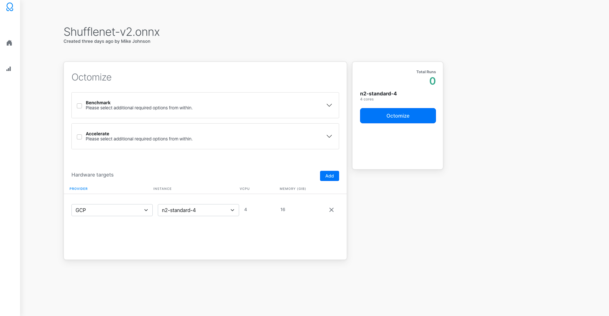
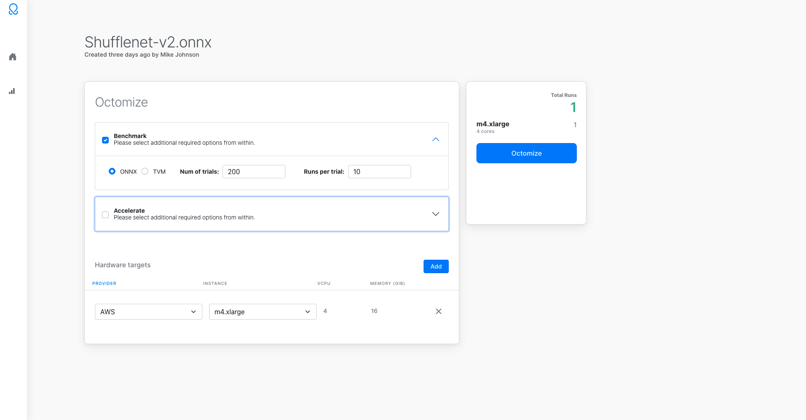
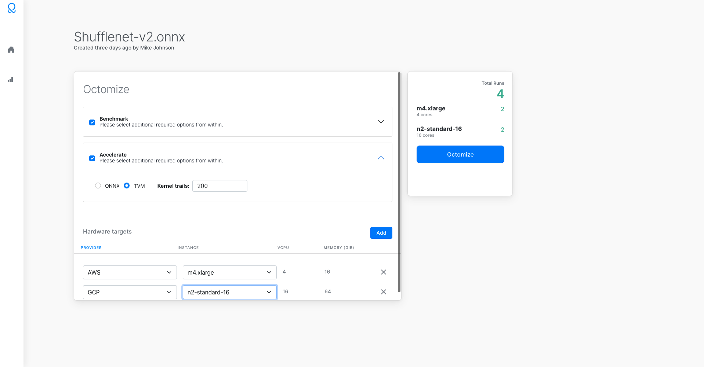
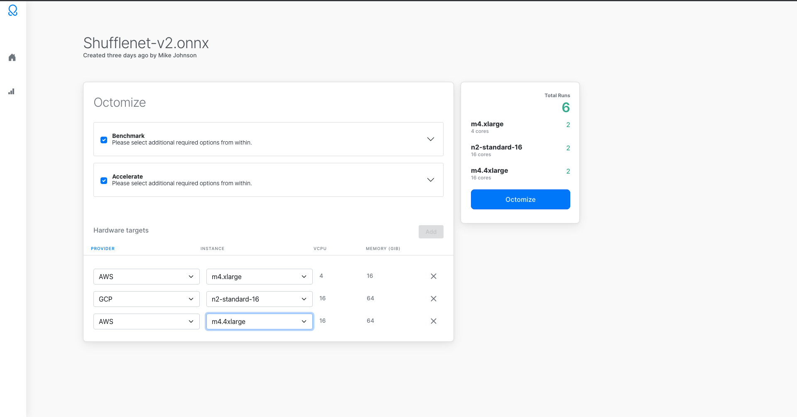
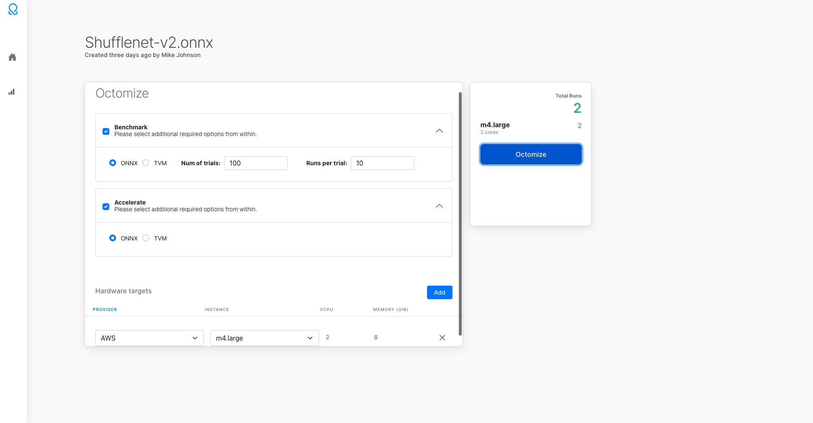
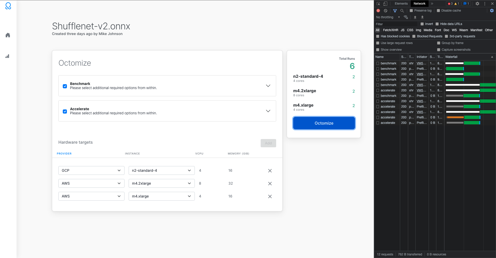
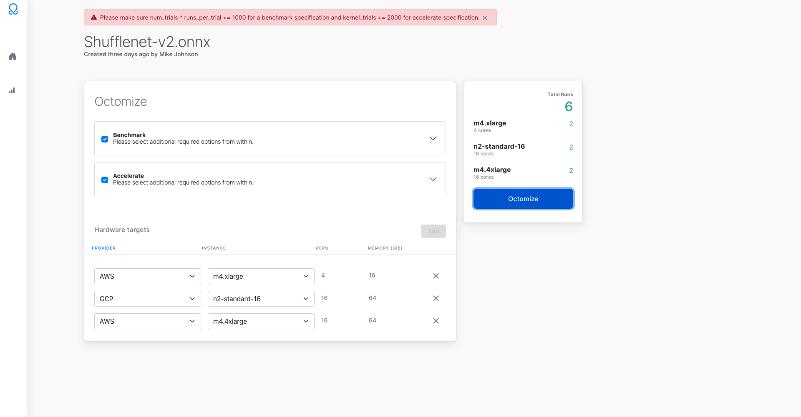

# Netheria

## Screenshots

### Default state

### One target and one action

### Multiple targets and actions

### Collapsed multi target and multi action

### Multiple expanded actions

### Successful octomize calls

### Error condition

## Running locally

### `yarn`

### `yarn start`
